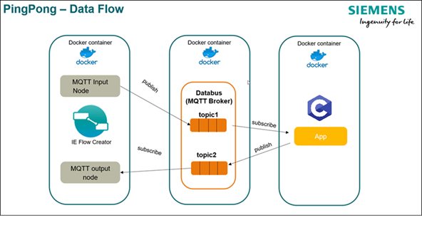
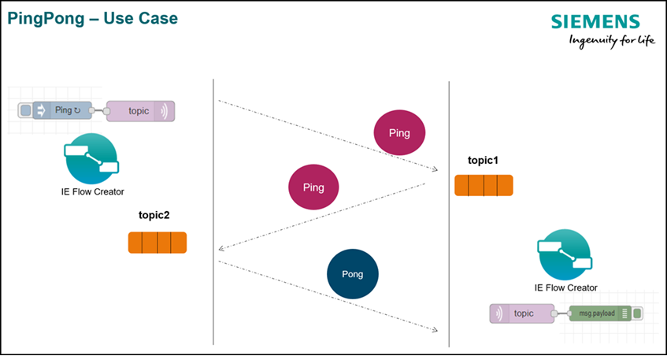

# Databus Ping Pong C

This application example contains the source files to build a Databus Ping Pong application implemented in C.

- [Databus Ping Pong C](#databus-ping-pong-c)
  - [Description](#description)
    - [Overview](#overview)
    - [General task](#general-task)
  - [Requirements](#requirements)
    - [Used components](#used-components)
    - [Further requirements](#further-requirements)
  - [Installation](#installation)
  - [Usage](#usage)
  - [Documentation](#documentation)
  - [Contribution](#contribution)
  - [Licence and Legal Information](#licence-and-legal-information)

## Description

This repository contains the source files to build the Databus Ping Pong application example implemented in C. Please refer to the [Ping Pong in Python repository](https://github.com/industrial-edge/pingpong-python) for more information about this application example.

### Overview

This application example shows how to connect to the IE Databus via MQTT and how to publish and subscribe data using an implementation in C. The IE Flow Creator is used to exchange data between different topics within the IE Databus. This example uses the [Eclipse Paho MQTT C library](https://github.com/eclipse/paho.mqtt.c) to enable the connection to the IE Databus.

It also uses a multi-stage process for building the docker image to keep the image size as small as possible. The two ``FROM`` Statements in the [Dockerfile](src/Dockerfile) separate the build process into two stages. The fist stage is compiling the source code of the application and the paho library which then get copied to the second stage which will be the final image for the application. Please refer to the the [docker documentation](https://docs.docker.com/develop/develop-images/multistage-build/) for more information regarding multi-stage builds.

### General task

The application includes a MQTT client to subscribe to one topic of the IE Databus and waits to receive data. When data arrives, it publishes a corresponding answer to a second topic of the IE Databus. If it receives the string "Ping", it will answer with "Pong" and the other way around.

The names of the IE Databus topics as well as the credentials used by the application can be configured, otherwise environmental variables included in the docker-compose file are used.

## Requirements

### Used components

- Industrial Edge Management V1.2.0-36 / V1.2.14
  - IE Databus V1.2.16
  - IE Databus Configurator V1.2.23
  - IE Flow Creator V1.1.2
- Industrial Edge Device V1.2.0-56
- Industrial Edge App Publisher V1.2.7
- Docker Engine V20.10.3
- Docker Compose V1.28.5

### Further requirements

- IE Device is onboarded to a IE Management
- IE Databus Configurator is deployed to the IE Management
- IE Databus is deployed to the IE Device
- IE Flow Creator is deployed to the IE Device

## Installation

Please refer to the [Installation](https://github.com/industrial-edge/pingpong-python/blob/main/docs/Installation.md) section of the *Ping Pong in Python* repository on how to build and deploy the application to a Industrial Edge Device.
When creating a configuration for the application in the Industrial Edge Management System, you can use the the [mqtt-config.json](cfg-data/mqtt-config.json) file from this repository.

## Usage

Once the application is successfully deployed, it can be tested using the IE Flow Creator.

Please refer to the [Testing](https://github.com/industrial-edge/pingpong-python/blob/main/docs/Installation.md#testing-the-application-using-simatic-flow-creator) section of the *Ping Pong in Python* repository on how to use it.

## Documentation

You can find further documentation and help in the following links

- [Industrial Edge Hub](https://iehub.eu1.edge.siemens.cloud/#/documentation)
- [Industrial Edge Forum](https://www.siemens.com/industrial-edge-forum)
- [Industrial Edge landing page](https://new.siemens.com/global/en/products/automation/topic-areas/industrial-edge/simatic-edge.html)
- [Industrial Edge GitHub page](https://github.com/industrial-edge)

## Contribution

Thanks for your interest in contributing. Anybody is free to report bugs, unclear documentation, and other problems regarding this repository in the Issues section or, even better, is free to propose any changes to this repository using Merge Requests.

## Licence and Legal Information

Please read the [Legal information](LICENSE.md).
